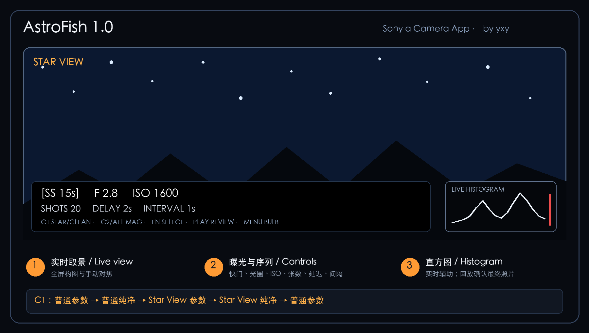

<p align="center">
  
</p>

<h1 align="center">AstroFish</h1>

<p align="center"><strong>Star View &amp; Long Exposure Intervalometer for Sony α Cameras</strong></p>

<p align="center">Sony PlayMemories Camera Apps 平台的星空取景、手动对焦与长曝光工具。</p>

## 功能 / Features

- 普通实时取景与暗光 Star View / Normal live view and low-light Star View
- 普通与 Star View 纯净取景 / Clean preview for both modes
- 快门、电子光圈、ISO、张数、延迟和间隔控制
- Shutter, electronic aperture, ISO, shots, delay, and interval controls
- 手动对焦放大与区域移动 / Manual-focus magnification and movable focus area
- 实时亮度直方图 / Live luminance histogram
- 31 秒至 6 小时定时 BULB / Timed BULB from 31 seconds to 6 hours
- 长曝光间隔拍摄 / Long-exposure interval sequences
- 照片回放、1×/2×/4× 放大和照片直方图
- Card playback with 1×/2×/4× zoom and photo histogram



## 下载与安装 / Download and Installation

从 [Releases](../../releases/latest) 下载 `AstroFish-1.0.0.apk`，使用 PMCA-RE 或兼容的 PlayMemories Camera Apps 安装工具通过 USB 安装。

Download `AstroFish-1.0.0.apk` from [Releases](../../releases/latest), then install it over USB with PMCA-RE or another compatible PlayMemories Camera Apps installer.

- 应用名称 / Label: `AstroFish`
- 包名 / Package: `com.yxy.astrofish`
- 日志 / Log: `ASTROFISH/LOG.TXT`

AstroFish 使用独立包名，不会覆盖原来的 A7R Astro 长曝光应用或早期 Live View 测试版。

AstroFish uses an independent package and does not replace the original A7R Astro intervalometer or the earlier Live View test package.

## 支持范围 / Compatibility

当前版本以第一代 Sony α7R（ILCE-7R）开发和验证，固件版本3.2。α7R II、α7S、α7S II 等 PlayMemories Camera Apps 机型可能具备运行条件，建议第一次测试时使用格式化的空卡，以防死机导致数据丢失。

Version 1.0 was developed and verified on the first-generation Sony α7R (ILCE-7R). Other PlayMemories Camera Apps bodies may be capable of running it, but require separate physical verification.

## 快速操作 / Quick Controls

| 按键 / Control | 功能 / Function |
|---|---|
| C1 | 普通参数 → 普通纯净 → Star 参数 → Star 纯净 / Four-view cycle |
| Fn / Up / Down | 选择参数 / Select a setting |
| Left / Right / dials | 修改参数 / Adjust the selected setting |
| C2 / AEL | 对焦放大 / Focus magnification |
| Center / shutter | 开始或停止序列 / Start or stop a sequence |
| Menu | 定时 BULB／长曝光 / Timed BULB and long exposure |
| Playback | 照片回放 / Card playback |
| Fn / DISP in playback | 照片直方图 / Photo histogram |

完整中英文说明见 [User Guide](docs/AstroFish-1.0.0-User-Guide-ZH-EN.md)，一页速查卡见 [Quick Reference](docs/AstroFish-1.0.0-Quick-Reference-ZH-EN.png)。

See the bilingual [User Guide](docs/AstroFish-1.0.0-User-Guide-ZH-EN.md) and one-page [Quick Reference](docs/AstroFish-1.0.0-Quick-Reference-ZH-EN.png).

## 构建 / Build

The project targets Android API 10 and uses JDK 8, Gradle 3.5, and Android build-tools 25.0.2.

```sh
./build-local.sh
```

This runs the Java tests and creates a debug APK. `build-release.sh` additionally aligns and signs the formal release with the private AstroFish key. Release signing material is intentionally excluded from the repository.

Current automated checks:

- 10 ISO capability-list edge cases
- 3027 capture-scheduling assertions
- 12 luminance-histogram assertions
- 10 shutter-display assertions

## 来源与许可证 / Sources and License

AstroFish uses the Sony camera interfaces exposed by [OpenMemories Framework](https://github.com/ma1co/OpenMemories-Framework). Earlier long-exposure work was based on the PMCADemo reference project. See [LICENSE.txt](LICENSE.txt) for retained notices.

AstroFish is a third-party project and is not an official Sony application. Sony and α are trademarks of their respective owners.

Author: **yxy / 想飞的咸鱼**  
Support: Xiaohongshu **想飞的咸鱼**, ID **616710483**

