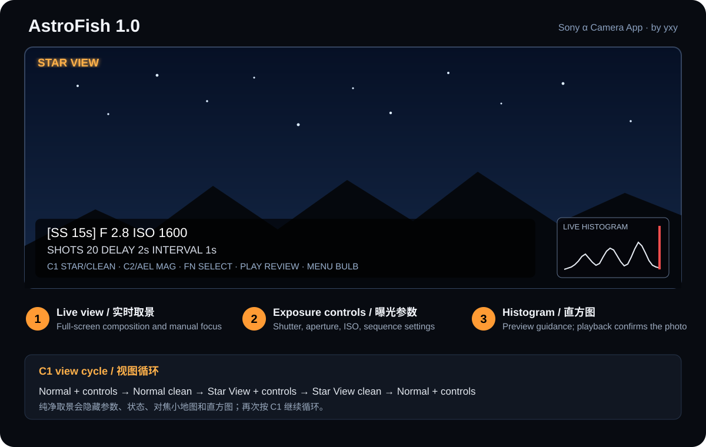

# AstroFish 1.0 使用说明 / User Guide

**Star View & Long Exposure Intervalometer for Sony α Cameras**  
版本 / Version: 1.0.0 · 发布日期 / Release date: 2026-09-17  
作者 / Author: **yxy（想飞的咸鱼）**  
问题咨询 / Support: 小红书 **想飞的咸鱼**，ID **616710483**

---

# 第一部分：中文使用说明

## 1. 适用范围与功能

AstroFish 是运行在 Sony PlayMemories Camera Apps 平台上的第三方机内摄影应用，用实时取景替代应用内的普通预览界面，面向星空对焦、构图、常规拍摄与长曝光间隔拍摄。

当前版本以第一代 Sony α7R（ILCE-7R）开发和验证。α7R II、α7S、α7S II 等支持 PlayMemories Camera Apps 的机型可能具备运行条件，但相机接口、按键扫描码和固件行为仍需分别实机确认，不能视为已经完整兼容。

主要功能：

- 普通实时取景与暗光 **Star View**
- 普通与 Star View 各自的纯净取景
- 快门、电子光圈、ISO、张数、启动延迟和间隔设置
- 手动对焦、对焦放大与放大区域移动
- 实时亮度直方图
- 31 秒至 6 小时定时 BULB 和长曝光间隔拍摄
- 存储卡照片回放、1×/2×/4× 放大与照片直方图
- 自动保存序列参数和异常恢复信息

## 2. 界面示意图

参数视图右下角显示实时直方图。纯净取景会隐藏参数、状态、帮助、对焦小地图和直方图，使画面尽可能大。

## 3. 安装与应用共存

1. 在电脑上启动 PMCA-RE 或兼容的 PlayMemories Camera Apps 安装工具。
2. 使用 USB 将相机连接至电脑。
3. 选择 `AstroFish-1.0.0.apk` 并安装。
4. 从相机应用程序列表启动 **AstroFish**。

正式版包名为 `com.yxy.astrofish`。它不会覆盖原来只有长曝光功能的 A7R Astro，也不会覆盖早期 `A7R Astro LV Test` 测试版。以后使用相同包名和同一发布签名的 AstroFish 新版可以直接覆盖升级。

## 4. 拍摄前准备

- 将模式拨盘设为 `M`（手动曝光）。
- 使用手动对焦；应用不会执行自动对焦。
- 电子镜头可以尝试在应用中调整光圈；机械手动镜头需使用镜头光圈环。
- 长曝光间隔拍摄建议关闭“长时间曝光降噪”，否则每张照片后可能产生与曝光时间相同的处理等待。
- 建议使用状态良好、速度足够且在本机格式化的存储卡。
- 第一次使用新机型、固件或存储卡时，先完成三张短序列测试。

## 5. 主实时取景按键

| 按键 | 功能 |
|---|---|
| Fn | 依次选择快门、光圈、ISO、张数、启动延迟、间隔 |
| 上／下 | 选择参数；放大时上下移动区域 |
| 左／右、拨轮 | 修改参数；放大时左右移动区域 |
| C1 | 循环四种取景视图 |
| C2 或 AEL/AF-MF | 循环机身支持的对焦放大倍率，最后返回全景 |
| 中心键 | 开始／停止序列；放大时将区域移回中心 |
| 半按快门 | 退出对焦放大，不执行自动对焦 |
| 全按快门 | 开始序列；再次按下请求停止 |
| Menu | 进入定时 BULB／长曝光页面 |
| 播放键 | 打开存储卡照片回放 |
| 删除键 | 待机退出；序列中请求停止 |

直接转动镜头对焦环完成手动对焦。对焦放大倍率和可移动范围由机身提供。

## 6. 四种实时取景视图

每按一次 `C1`，按以下顺序循环：

1. 普通参数视图
2. 普通纯净取景
3. Star View 参数视图
4. Star View 纯净取景

Star View 优先尝试 Sony 机身提供的慢速取景能力；若机身不支持或拒绝设置，则临时使用机身支持的较高 ISO 作为预览后备。界面只显示 `STAR VIEW`，具体采用哪种方式会记录在日志中。

Star View 只帮助暗处构图与对焦。开始拍摄前，应用会恢复正式拍摄 ISO、慢速取景和预览模式并读回确认；恢复失败时会阻止拍摄，避免把临时预览参数误用于照片。拍摄结束后会恢复原来的 Star View 状态。

## 7. 主界面参数

- **SS**：快门速度，按 `30s`、`1.3s`、`1/125` 等摄影常用格式显示；BULB 显示为 `BULB`。定时 BULB 请按 `Menu`。
- **F**：电子镜头光圈。机械镜头或不支持电子控制的镜头可能显示 `--`。
- **ISO**：照片使用的正式拍摄 ISO，不是 Star View 的临时预览 ISO。
- **SHOTS**：1–999 张，默认 1 张。
- **DELAY**：第一张拍摄前等待 0–3600 秒，默认 2 秒。
- **INTERVAL**：上一张完成后再等待 0–3600 秒，默认 0 秒；不包含存卡和恢复取景所需时间。

张数、延迟和间隔会在退出后保留；快门、光圈与 ISO 读取相机当前状态。

## 8. 实时直方图

参数视图右下角显示 64 级亮度直方图，约每 300 毫秒刷新。程序优先使用 Sony 原生预览分析数据，无法取得时尝试标准预览帧；没有数据时显示 `NO DATA`。

- `LIVE`：普通实时取景亮度。
- `EXP EST`：高 ISO 后备增强时，按正式拍摄 ISO 与预览 ISO 的比例作近似校正。
- `VIEW`：慢速取景画面，无法可靠反推最终照片曝光。
- `S`：暗部像素集中；`H`：亮部像素集中。

实时直方图受机内伽马、降噪和预览处理影响，尤其在长曝光时不会与最终 RAW/JPEG 完全相同。它适合快速调参，最终判断以试拍后的回放直方图为准。纯净取景不显示直方图。

## 9. 常规拍摄与停止

中心键或全按快门开始单张或多张序列。应用等待照片完成回调，再计算间隔并拍摄下一张。

在启动倒计时和间隔等待期间，停止请求立即生效；正在曝光或保存时，应用会完成当前照片后停止，不再开始下一张。Star View 临时参数会在拍摄前恢复，拍摄结束后重新启用。

## 10. 定时 BULB／长曝光页面

在主实时取景按 `Menu` 进入长曝光页面。页面采用大尺寸 3:2 取景画面，参数以半透明浮层显示；倒计时或拍摄开始后自动隐藏参数区，只保留窄状态栏。

可设置：

- **EXPOSURE**：31 秒至 6 小时。
- **ISO**：正式拍摄感光度。
- **INTERVAL**：一张结束后到下一张开始前的额外等待。
- **SHOTS**：1–999，或 `INFINITE` 持续拍摄。
- **START DELAY**：第一张曝光前的等待。
- **WAIT SAVE**：`YES` 等待保存完成回调，可靠性优先；`NO` 在关闭快门后尽快继续，间隙更短但需要自行验证机身和存储卡稳定性。

上／下选择参数，左／右修改，中心键或快门键开始／停止。`C1` 与主页面一样循环普通、普通纯净、Star View、Star View 纯净。播放键进入回放。待机按删除键返回主界面。

首次或重要拍摄建议使用 `WAIT SAVE=YES`。星轨可先尝试 `INTERVAL=0s`、`START DELAY=2–10s`，并关闭机身长时间曝光降噪。

## 11. 照片回放、放大与直方图

主页面或长曝光页面待机时按播放键，默认打开最新照片。

| 按键 | 回放功能 |
|---|---|
| 左／右 | 1× 时浏览照片；放大后左右移动 |
| 上／下 | 1× 时浏览照片；放大后上下移动 |
| 中心键 | 按 1× → 2× → 4× → 1× 循环 |
| Fn 或 DISP | 显示／隐藏照片直方图 |
| 播放键或删除键 | 返回实时取景 |

回放直方图来自存储卡照片的预览 JPEG，适合判断刚拍照片的整体曝光与亮部溢出。RAW 文件显示的是内嵌预览，不能代替电脑软件展开 RAW 后的直方图。

## 12. 建议的星空工作流程

1. 在主页面设置预计使用的快门、光圈和 ISO。
2. 按 `C1` 进入 Star View，完成构图。
3. 按 `C2` 或 `AEL/AF-MF` 放大明亮星点，移动区域并转动对焦环。
4. 半按快门返回全景，必要时切到 Star View 纯净取景检查边缘构图。
5. 拍一张测试照片，按播放键并用 Fn/DISP 调出照片直方图。
6. 根据测试照片调整参数；需要超过 30 秒时按 Menu 使用定时 BULB。
7. 正式多张拍摄前先完成三张短序列并核对文件数量。

## 13. 日志与故障排查

日志位置：`ASTROFISH/LOG.TXT`

咨询时请尽量提供 AstroFish 版本、相机型号与固件、镜头、拍摄格式、完整参数和 `LOG.TXT`。

### 直方图显示 NO DATA

机身没有提供原生分析数据，标准预览帧后备也不可用。取景和拍摄仍可继续；请使用测试照片的回放直方图判断曝光。

### Star View 后无法开始拍摄

应用未能确认临时 ISO 或慢速取景已经恢复，因此主动阻止拍摄。按 `C1` 重试恢复；仍失败时退出应用并重新打开，查看日志中的恢复错误。

### 对焦放大或某个按键无响应

不同机型和固件的 CameraEx 能力及扫描码可能不同。先尝试 `C2` 与 `AEL/AF-MF` 两个入口，并在咨询时提供机型、固件和日志。

### 长曝光开始时报 RuntimeException

退出应用，将机身驱动模式设为“单张拍摄”后重试。这里指机身驱动模式，不是应用内的 `SHOTS=1`。

### 长时间停在 Waiting for photo save

检查长时间曝光降噪、存储卡速度和 RAW+JPEG 设置。必要时仅用 RAW 或 JPEG 测试，并提供日志。

## 14. 安全与限制

- 测试新机型或新版本时，不要立即进行无人值守的整夜拍摄。
- 长曝光开始和结束时确认机械快门确实打开、关闭；如程序报错且快门仍开启，请退出应用或关闭相机电源。
- `WAIT SAVE=NO` 需要自行验证机身与存储卡稳定性。
- Star View 和实时直方图用于取景辅助，不能保证与最终照片完全一致。
- 本应用为第三方工具，并非 Sony 官方应用；Sony 与 α 是其各自权利人的商标。

---

# Part Two: English User Guide

## 1. Scope and Features

AstroFish is a third-party in-camera application for the Sony PlayMemories Camera Apps platform. It provides its own live-view shooting screen for night-sky composition, manual focusing, normal capture, and long-exposure interval sequences.

Version 1.0 was developed and verified on the first-generation Sony α7R (ILCE-7R). Other PlayMemories Camera Apps bodies, including the α7R II, α7S, and α7S II, may be capable of running it, but their camera APIs, key scan codes, and firmware behavior require separate physical testing and are not claimed as fully compatible.

Main features:

- Normal live view and low-light **Star View**
- Clean preview for both normal and Star View modes
- Shutter, electronic aperture, ISO, shot count, start delay, and interval controls
- Manual focus, focus magnification, and movable magnification area
- Live luminance histogram
- Timed BULB from 31 seconds to 6 hours and long-exposure sequences
- Card playback with 1×/2×/4× zoom and photo histogram
- Persistent sequence settings and recovery information

## 2. Interface Diagram

The live histogram appears at the lower right of a parameter view. Clean preview hides settings, status, help, the focus map, and the histogram to maximize the image.

## 3. Installation and Coexistence

1. Start PMCA-RE or another compatible PlayMemories Camera Apps installer.
2. Connect the camera to the computer by USB.
3. Select and install `AstroFish-1.0.0.apk`.
4. Launch **AstroFish** from the camera application list.

The formal package is `com.yxy.astrofish`. It does not replace the original long-exposure-only A7R Astro or the earlier `A7R Astro LV Test` package. Future AstroFish builds using the same package and release signing key can upgrade this installation directly.

## 4. Camera Preparation

- Set the mode dial to `M` (Manual Exposure).
- Focus manually; the app does not perform autofocus.
- Electronic lenses may allow in-app aperture control. Use the aperture ring on a mechanical manual lens.
- Disable Long Exposure NR for interval work; otherwise, processing after each image may last as long as the exposure.
- Use a healthy, sufficiently fast memory card, preferably formatted in the camera.
- Run a short three-shot test whenever using a new camera body, firmware, or card.

## 5. Main Live-View Controls

| Control | Function |
|---|---|
| Fn | Select shutter, aperture, ISO, shots, start delay, or interval |
| Up/Down | Select a setting; move the magnified area vertically |
| Left/Right or dials | Change a setting; move the magnified area horizontally |
| C1 | Cycle through the four viewing modes |
| C2 or AEL/AF-MF | Cycle supported focus magnification levels, then return to full view |
| Center button | Start/stop a sequence; recenter the magnified area |
| Half-press shutter | Leave magnification without autofocus |
| Full-press shutter | Start a sequence; press again to request a stop |
| Menu | Open the timed BULB/long-exposure page |
| Playback | Open card playback |
| Trash | Exit while idle; request a stop during a sequence |

Turn the lens focus ring to focus manually. Magnification levels and movement limits are supplied by the camera.

## 6. Four Live-View Modes

Each press of `C1` advances through:

1. Normal view with controls
2. Normal clean preview
3. Star View with controls
4. Star View clean preview

Star View first attempts to use Sony's slow-shutter live-view capability. If the body does not support or accept it, the app temporarily uses a higher supported ISO as a preview fallback. The screen only shows `STAR VIEW`; the selected method is recorded in the log.

Star View is a composition and focusing aid. Before capture, AstroFish restores the photo ISO, slow-view state, and preview mode and verifies the result. Capture is blocked if restoration cannot be confirmed. The previous Star View state returns after the sequence.

## 7. Main-Screen Settings

- **SS:** shutter speed in familiar forms such as `30s`, `1.3s`, or `1/125`; BULB is shown as `BULB`. Press `Menu` for timed BULB.
- **F:** electronic lens aperture. Mechanical or unsupported lenses may show `--`.
- **ISO:** the ISO used for the photo, separate from any temporary Star View ISO.
- **SHOTS:** 1–999, default 1.
- **DELAY:** 0–3600 seconds before the first image, default 2 seconds.
- **INTERVAL:** 0–3600 seconds after one image completes; it excludes card writing and live-view recovery time.

Shots, delay, and interval persist after exit. Shutter, aperture, and ISO are read from the current camera state.

## 8. Live Histogram

The parameter view displays a 64-bin luminance histogram refreshed about every 300 ms. AstroFish prefers Sony native preview analysis and falls back to standard preview frames. `NO DATA` appears when neither source is available.

- `LIVE`: normal live-view brightness.
- `EXP EST`: approximate correction when the high-ISO Star View fallback is active.
- `VIEW`: slow live view that cannot be mapped reliably to final exposure.
- `S`: shadow concentration; `H`: highlight concentration.

The live histogram is affected by in-camera gamma, noise reduction, and preview processing and will not exactly match the final RAW/JPEG, particularly for long exposures. Use it for quick adjustment and use the captured-photo histogram for the final decision. Clean preview hides the histogram.

## 9. Normal Capture and Stopping

Press the center button or fully press the shutter to begin a single or multi-shot sequence. AstroFish waits for completion before applying the interval and scheduling the next image.

A stop request acts immediately during the start delay or interval. During exposure or saving, the current image completes and no next image is started. Temporary Star View settings are restored before capture and re-enabled afterward.

## 10. Timed BULB / Long-Exposure Page

Press `Menu` from the main screen. A large centered 3:2 preview is retained while settings appear on translucent panels. The parameter panel hides automatically during countdown and capture, leaving a narrow status strip.

Settings:

- **EXPOSURE:** 31 seconds to 6 hours.
- **ISO:** photo sensitivity.
- **INTERVAL:** extra wait after one image and before the next.
- **SHOTS:** 1–999 or `INFINITE`.
- **START DELAY:** wait before the first exposure.
- **WAIT SAVE:** `YES` waits for save-completion callbacks for reliability; `NO` continues sooner after shutter close but requires testing with the specific camera and card.

Use Up/Down to select, Left/Right to change, and Center or the shutter to start/stop. `C1` uses the same four-view cycle as the main page. Playback opens card review. Trash returns while idle.

Use `WAIT SAVE=YES` for initial and important sessions. For star trails, begin with `INTERVAL=0s`, `START DELAY=2–10s`, and Long Exposure NR disabled.

## 11. Photo Playback, Zoom, and Histogram

Press Playback while idle on either shooting page. The newest image opens first.

| Control | Playback function |
|---|---|
| Left/Right | Browse at 1×; move horizontally when zoomed |
| Up/Down | Browse at 1×; move vertically when zoomed |
| Center button | Cycle 1× → 2× → 4× → 1× |
| Fn or DISP | Show/hide the photo histogram |
| Playback or Trash | Return to live view |

The playback histogram comes from the image preview JPEG on the card. It is useful for judging overall exposure and highlight clipping. For RAW files it represents the embedded preview and does not replace a histogram produced from developed RAW data.

## 12. Recommended Night-Sky Workflow

1. Set the intended shutter, aperture, and ISO on the main page.
2. Press `C1` to enter Star View and compose.
3. Press `C2` or `AEL/AF-MF`, move to a bright star, and turn the focus ring.
4. Half-press the shutter to return to full view; use Star View clean preview to check edge composition if needed.
5. Capture a test image, press Playback, and use Fn/DISP to open its histogram.
6. Adjust exposure from the test image. Press Menu when more than 30 seconds is required.
7. Run a three-shot sequence and confirm the file count before a long unattended session.

## 13. Logs and Troubleshooting

Log location: `ASTROFISH/LOG.TXT`

For support, include the AstroFish version, camera and firmware, lens, file format, full settings, and `LOG.TXT` whenever possible.

### Histogram shows NO DATA

The body supplied neither native analysis nor usable fallback frames. Live view and capture can continue; judge exposure with the captured-photo histogram.

### Capture is blocked after Star View

AstroFish could not confirm restoration of a temporary ISO or slow-view setting. Press `C1` to retry. If it still fails, exit and reopen the app, then inspect the restoration error in the log.

### Focus magnification or a key does not respond

CameraEx capabilities and scan codes may vary by body and firmware. Try both `C2` and `AEL/AF-MF`, and provide the body, firmware, and log when reporting the problem.

### RuntimeException when starting long exposure

Exit the app, set the camera drive mode to Single Shooting, and retry. This means the camera drive mode, not `SHOTS=1` in AstroFish.

### Long delay at Waiting for photo save

Check Long Exposure NR, card speed, and RAW+JPEG. Test RAW-only or JPEG-only if necessary and provide the log.

## 14. Safety and Limitations

- Do not begin with an unattended all-night session on a new body or app build.
- Confirm that the mechanical shutter opens and closes for long exposures. If an error appears while it remains open, exit the app or power off the camera.
- `WAIT SAVE=NO` requires stability testing with the specific body and card.
- Star View and the live histogram are focusing and exposure aids; they cannot guarantee an exact match to the final image.
- AstroFish is a third-party tool and is not an official Sony application. Sony and α are trademarks of their respective owners.

